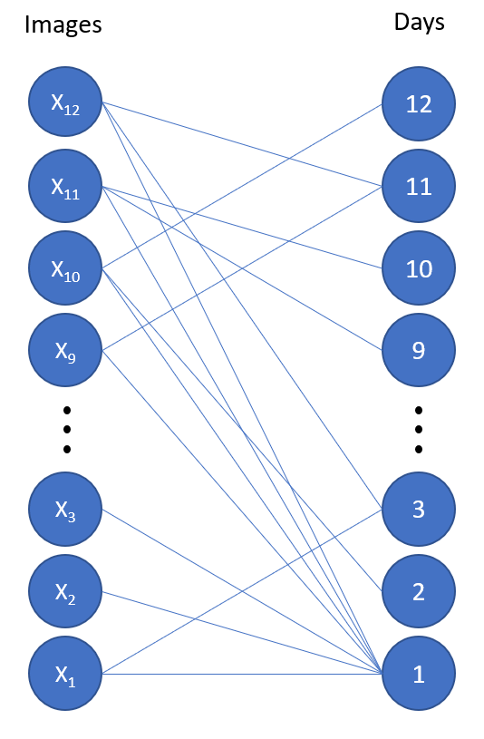

# Install
```
pip install -r requirements.txt
```

# Run
You'll need an azure cognitive services key if you want to scrape for new images. Otherwise the script can run utilizing the existing object images in the repo. [Quickstart](https://docs.microsoft.com/en-us/azure/cognitive-services/bing-web-search/quickstarts/python)
```
make clean
python main.py
```

# About
Two part Python coding challenge. 

## Prompt
It's time to start our next coding challenge!

```
On the third day of Christmas my true love sent to me
Three French hens,
Two turtle doves,
And a partridge in a pear tree.
```

This one comes in two parts - perfect for you to form a collaboration with someone and tackle each half, or do both, swap, and see just how good your solutions are.
 

Part 1 - The Twelve Days of Christmas

In this part, you'll create a script to provide images for the Twelve Days of Christmas song. Each time you run the script, it should get different images (within reason, though if you decide to programmatically generate them rather than scrape them off the web... 🤔).
 
Feel free to get creative here - there are plenty of fun possibilities! The output should be twelve image files (JPEG or PNG), randomly named, and recognizable enough for part two...
 

Part 2 - How Many Days of What?

In this part, create a script that accepts twelve randomly named image files that represent the Twelve Days of Christmas (from part 1) and will rename them to Day<whatever>.jpg (or .png).
 
How? Completely up to you! Depending on how creative you (or your friends/enemies) have been in part 1, this could be challenging, but there are also some not-quite-obvious strategies that can give you an advantage!


## Solution
### Part 1 - Image generation
First part involves generating images for the 12 days of Christmas. This code is in the `dozen_days_generator` folder. Each day gets an image with a different number of common objects in the image. We are using `cvlib` which has an API for detecting common objects using the **YOLOv3** model. This model has a list of ~80 common objects. We scrape the web for those search terms (using Bing's search APIs) and pull down a handful of images for each search term. Then we do some image manipulation to ensure we have the correct number of objects based on the day.

### Part 2 - Image detection
Second part involves getting a set of 12 randomly labeled images and classifying them according to what day they represent. Run each image through cvlib's detect_common_objects api and then count up each instance of an object per image (e.g. this image has 4 apples, 1 dog, 10 cats, etc). This would give a Counter dictionary with the objects and their counts per image. Then if we think of each image and each day as nodes on a graph, we have an edge on the graph between images and days when that particular image contains X number of something. So the image with 4 apples, 1 dog, and 10 cats would have an edge to days 1, 4, and 10. If you draw it all out we get the below image.



each edge from image X_i to day X represents X occurrences of something in that image.
 
There's an algorithm for this type of problem. The graph is bipartite (two distinct sets of nodes with no edges between nodes within the same set). I just need to find a bipartite matching, so that each day is matched to a single image. In particular we probably would want the maximum bipartite matching, b/c almost every image should have 1 occurence of something, but very few would have 10, 11, or 12. We use **networkx** for this part of the solution.

# Learnings
- Object detection
- networkx
- cvlib
